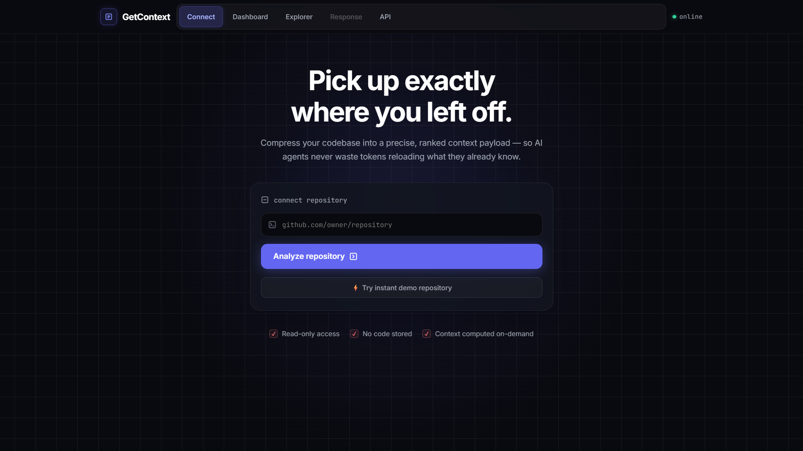

# GetContext

**One codebase. One context layer. Every AI understands it.**

🔗 **Live App:** [https://get-context.ai.studio/](https://get-context.ai.studio/)
```text
⚡ Built in a 3-hour prompt sprint event — from idea to a working, deployed app.
```


GetContext is a reusable context infrastructure layer between software repositories and AI coding assistants. Analyze a codebase once, then retrieve only the task-specific context any AI needs — instead of re-uploading the entire repository every time, and every time you switch agents.

---

## 🎯 The Problem

When building with AI agents, context windows fill up quickly or sessions get interrupted. Starting a fresh agent session often means either explaining everything from scratch or dumping the whole codebase into prompt tokens — burning token budgets, slowing down responses, and filling the window with irrelevant files.

---

## 💡 The Solution

1. **Analyze Once**: Connect any public GitHub repository (or use the built-in fixture). GetContext indexes the file structure, detects the tech stack, identifies key files, and tracks recent commit activity.
2. **Retrieve On-Demand**: When you ask a task-specific question, GetContext ranks and extracts only the relevant files and code snippets with exact token metrics.
3. **AI Explanations**: Uses the Google GenAI SDK (`gemini-3.6-flash`) for concise, architecture-aware answers with fallback support.
4. **Interactive Context Graph**: Visually inspect the connected repository nodes and relationships between modules and files.
5. **Resume in Any Agent**: Download a structured, portable Markdown context bundle containing the codebase hierarchy, key file previews, recent commits, and a session worklog. Paste it into Claude, ChatGPT, Cursor, Gemini, or any coding agent to resume work seamlessly.

---

## 🏗️ Architecture

```text
┌────────────────────────────────────────────────────────┐
│                   Frontend (React + Vite)              │
│  - Repo Connection & Analysis Dashboard               │
│  - Interactive Context Graph & File Tree               │
│  - Context Explorer & Live AI Response Panel           │
│  - Token Compression Meter & Context API Inspector     │
└───────────────────────────┬────────────────────────────┘
                            │ HTTP / JSON
┌───────────────────────────▼────────────────────────────┐
│              Unified Express Backend Server             │
│  - GitHub Repository Analyzer & Tech Stack Detector     │
│  - Deterministic Keyword & Path Relevance Ranker       │
│  - Firestore Persistence (with memory cache fallback)   │
│  - Gemini API Client (@google/genai)                   │
└───────────────────────────┬────────────────────────────┘
              ┌─────────────┴─────────────┐
              ▼                           ▼
    ┌──────────────────┐        ┌──────────────────┐
    │  GitHub REST API │        │ Gemini GenAI API │
    │ (or Demo Fixture)│        │ (3.6-flash/lite) │
    └──────────────────┘        └──────────────────┘
```

---

## ✨ Features

- **Repository Analysis**: Instant tree generation, automated tech stack detection, and key file previews via the GitHub REST API.
- **Deterministic Context Retrieval**: Fast keyword and stem-based ranking calculates relevance without requiring vector databases or embedding models.
- **Gemini AI Integration**: Server-side AI analysis powered by `@google/genai` using `gemini-3.6-flash` and `gemini-flash-latest`.
- **Accurate Token Metrics**: Real-time comparison showing total repository tokens vs. compressed context tokens, plus percentage reduction.
- **Interactive Context Graph**: Visual node-and-link representation of repository structure and key component modules.
- **Portable "Resume in New Agent" Export**: Generates a standardized Markdown payload including work notes, recent commits, file tree, and key file snippets ready for any AI assistant.
- **Context API Inspector**: Dedicated live view showing raw JSON request and response payloads from the `/api/context/query` endpoint.
- **Persistent Storage**: Backed by Google Cloud Firestore to retain repository analyses across container restarts and scale-to-zero lifecycles.
- **Zero-Friction Demo Mode**: Bundled fixture repository (`taskflow`) ensures immediate testing without rate limits or API setup requirements.
- **Fully Responsive**: Mobile-friendly navigation, adaptive layouts, and touch-optimized controls.

---

## 🛠️ Tech Stack

| Layer | Technology |
|---|---|
| **Frontend** | React 18, Vite, CSS custom properties, responsive grid/flexbox |
| **Backend** | Node.js, Express (unified full-stack server) |
| **AI SDK** | `@google/genai` (Gemini 3.6 Flash / Gemini Flash Latest) |
| **Database** | Google Cloud Firestore (with local memory fallback) |
| **Repo Source** | GitHub REST API v3 / Deterministic fixture fallback |
| **Port** | 3000 (standardized development and production) |

---

## 🔌 API Reference

### `POST /api/repository/analyze`
Analyzes a GitHub repository and indexes its file structure.

**Request:**
```json
{
  "url": "https://github.com/owner/repository"
}
```

**Response:**
```json
{
  "id": "repo_1723456789_1",
  "fullName": "owner/repository",
  "description": "Repository description...",
  "fileCount": 42,
  "fileTree": { "src": { "index.js": {} } },
  "technologies": ["Node.js", "Express", "React"],
  "importantFiles": ["README.md", "package.json"],
  "keyFiles": [
    { "path": "package.json", "preview": "{ \"name\": \"app\" ... }" }
  ],
  "recentCommits": [
    { "message": "feat: init project", "author": "dev", "date": "2026-08-01" }
  ],
  "repositoryTokens": 8144
}
```

---

### `POST /api/context/query`
Retrieves relevant files for a question and generates an AI explanation.

**Request:**
```json
{
  "repositoryId": "repo_1723456789_1",
  "query": "How does authentication work in this project?"
}
```

**Response:**
```json
{
  "answer": "Authentication is implemented using...",
  "answerSource": "gemini",
  "relevantFiles": [
    {
      "path": "src/auth/jwt.js",
      "relevanceScore": 14,
      "snippet": "export function verifyToken(req, res)...",
      "tokenEstimate": 240
    }
  ],
  "contextTokens": 480,
  "repositoryTokens": 8144,
  "reductionPercentage": 94.1
}
```

---

### `GET /api/repository/:id`
Retrieves stored analysis metadata for a previously indexed repository.

---

### `GET /api/health`
Health check endpoint returning server status, environment mode, and Gemini key availability:
```json
{
  "status": "ok",
  "hasGeminiKey": true,
  "environment": "production"
}
```

---

## 🚀 Getting Started

### 1. Installation
Clone the repository and install all dependencies:

```bash
npm install
```

### 2. Environment Configuration
Copy the example environment file and configure your keys:

```bash
cp .env.example .env
```

| Variable | Required | Description |
|---|---|---|
| `GEMINI_API_KEY` | Recommended | Server-side Gemini API key for live AI answers. |
| `GEMINI_MODEL` | Optional | Custom Gemini model (defaults to `gemini-3.6-flash`). |
| `GITHUB_TOKEN` | Optional | GitHub personal access token for higher rate limits (5,000 req/hr). |
| `PORT` | Optional | Application port (defaults to `3000`). |

> *Note: If `GEMINI_API_KEY` is not provided, GetContext automatically uses deterministic fallback explanations based on retrieved context.*

### 3. Development Server
Run the unified Express + Vite development server:

```bash
npm run dev
```
Open [http://localhost:3000](http://localhost:3000) in your browser.

### 4. Production Build & Deployment
Build the client assets and launch the production server:

```bash
npm run build
npm start
```

---

## 📋 Typical User Flow

1. **Connect**: Input a public GitHub URL or click **"Use demo repository"**.
2. **Review Repository**: Inspect detected tech stack, file counts, and recent commits.
3. **Explore Context**: Ask a specific question (e.g., *"Where are API routes defined?"*).
4. **Inspect Metrics**: View the ranked file list and token reduction (typically **85–95% smaller** than full repository size).
5. **Context Graph & Raw API**: Switch tabs to visualize repository architecture or inspect live API payloads.
6. **Resume**: Click **"Resume in New Agent"** to download the structured markdown context file and resume work in any AI assistant immediately.
